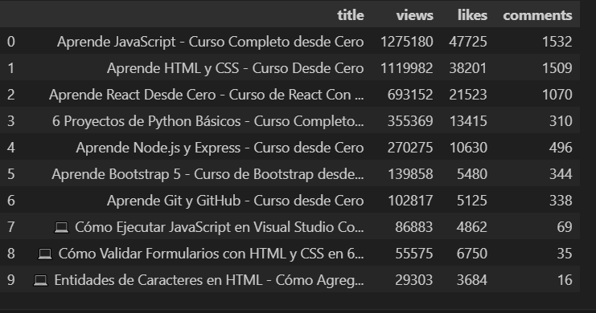

# YouTube Data API

The YouTube Data API with Python - Analyze Channel Statistics project is designed to empower developers and data enthusiasts to unlock the potential of YouTube analytics. By utilizing the YouTube Data API in conjunction with Python, this project will guide you through the process of extracting and analyzing channel statistics to gain valuable insights.

Throughout the project, you will learn how to set up API credentials, make API requests, and retrieve key information such as view counts, subscriber numbers, and video upload details. With Python programming, you'll dive into data manipulation, perform calculations, and generate meaningful visualizations to understand channel performance better.

The project offers a hands-on learning experience with practical examples and step-by-step instructions, ensuring that you gain the necessary skills to leverage YouTube Data API for channel analytics. Whether you're a content creator, a marketer, or a data-driven professional, this project will equip you with the tools and knowledge to make informed decisions, optimize your YouTube strategy, and drive success. Get ready to delve into the world of YouTube Data API and Python programming for comprehensive channel analysis!

## Views

  

## Setup

- Clone the project: `git@github.com:rOluochKe/youtube-data-api.git`
- Change directory into : `cd /youtube-data-api`
- Create your environment and install dependencies: `pip install -r requirements.txt`
- Get YouTube Data API V3 `API_KEY` from from Google Console and youtube `channel_id` from your favorite YouTube channel
- Add the keys in `main.py` file
- Run the app: `python main.py`
- The app will create a `.json` file in the root directory
- View analytics from the `youtube_analyzer.ipynb` from jupiter notebook
